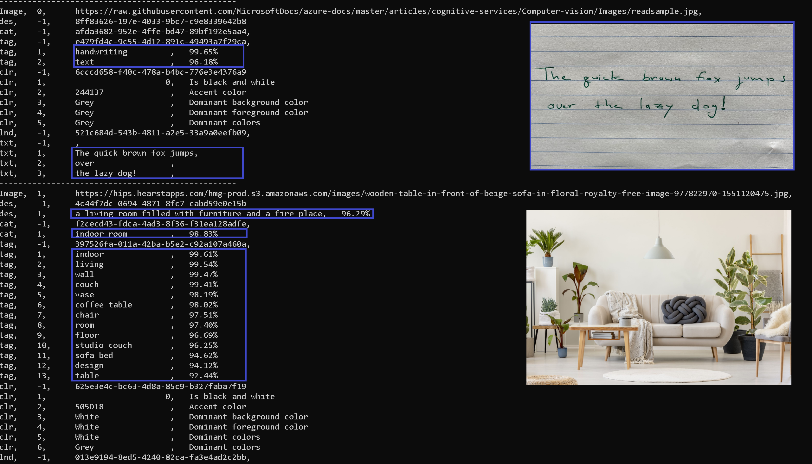

# AZURE Image Analyzer

In this project, the goal is to get as much as information as possible from an image (remote image) on Microsoft AZURE. The application returns human readable description, detected objects and category of the image as well as extracted text from the image using the [Computer Vision API (v3.0)](https://westcentralus.dev.cognitive.microsoft.com/docs/services/computer-vision-v3-ga/operations/5d986960601faab4bf452005) from Azure Cognitive Services.


## Running the app
 1. You need to sign up for the AZURE subscription [here](https://azure.microsoft.com/en-us/free/cognitive-services/). 
 2. Create and deploy a `Cognitive Services --> Computer Vision` [resource](https://portal.azure.com/#create/Microsoft.CognitiveServicesComputerVision). get the key and endpoint values from resource management tab.
 3. Run `pip install --upgrade azure-cognitiveservices-vision-computervision`
 4. Set the `key` and `endpoint` environmental variables taken from step 2 under `COMPUTER_VISION_SUBSCRIPTION_KEY` and `COMPUTER_VISION_ENDPOINT` respectively.
 5. Run `python analyze-image.py`
 6. Modify the code / ask questions :-)

## CV Functions

The functions implemented under utils are as follows:
 - `describe_image`: Describe images with human-readable language with the confidence score.
 - `categorize_image`: Categorize an Image with a confidence score.
 - `tag_image`: Tag an Image for each thing in the image.
 - `detect_color_image`: Detects the different aspects of its color scheme in a remote image.
 - `get_landmark_image`: Get  landmark info of the  image.
 - `extract_text_image`: Extract handwritten text in an image.

## Image input
For now, the images are defined as remote url. The function can be modified to read a list of images, or bein feeded from the search result directly! (TBD)

## Output
The current format is CSV in stdout. Proper JSON is TBD.

example: 
```
--------------------------------------------------
desc,   id,     key                 ,   value
Image,  1,      https://hips.hearstapps.com/hmg-prod.s3.amazonaws.com/images/wooden-table-in-front-of-beige-sofa-in-floral-royalty-free-image-977822970-1551120475.jpg,
des,    -1,     4c44f7dc-0694-4871-8fc7-cabd59e0e15b
des,    1,      a living room filled with furniture and a fire place,   96.29%
cat,    -1,     f2cecd43-fdca-4ad3-8f36-f31ea128adfe,
cat,    1,      indoor_room         ,   98.83%
tag,    -1,     397526fa-011a-42ba-b5e2-c92a107a460a,
tag,    1,      indoor              ,   99.61%
tag,    2,      living              ,   99.54%
tag,    3,      wall                ,   99.47%
tag,    4,      couch               ,   99.41%
tag,    5,      vase                ,   98.19%
tag,    6,      coffee table        ,   98.02%
tag,    7,      chair               ,   97.51%
tag,    8,      room                ,   97.40%
tag,    9,      floor               ,   96.69%
tag,    10,     studio couch        ,   96.25%
tag,    11,     sofa bed            ,   94.62%
tag,    12,     design              ,   94.12%
tag,    13,     table               ,   92.44%
tag,    14,     loveseat            ,   87.12%
tag,    15,     houseplant          ,   82.51%
tag,    16,     pillow              ,   78.21%
tag,    17,     bed                 ,   72.71%
tag,    18,     furniture           ,   70.48%
clr,    -1,     625e3e4c-bc63-4d8a-85c9-b327faba7f19
clr,    1,                         0,   Is black and white
clr,    2,      505D18              ,   Accent color
clr,    3,      White               ,   Dominant background color
clr,    4,      White               ,   Dominant foreground color
clr,    5,      White               ,   Dominant colors
clr,    6,      Grey                ,   Dominant colors
lnd,    -1,     013e9194-8ed5-4240-82ca-fa3e4ad2c2bb,
txt,    -1,     ,

```

